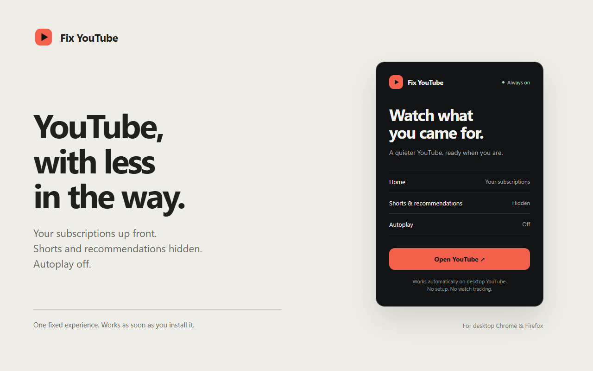

# Fix YouTube: hide Shorts and recommendations

Fix YouTube is a free, open-source browser extension that hides YouTube Shorts and recommendations, disables autoplay, and opens your Subscriptions feed by default. It has one fixed setup and nothing to configure.

Built for desktop Chrome, Helium and Firefox. Version 0.3.0 is available from [GitHub releases](https://github.com/LLRHook/fix-youtube/releases) for local installation; store publication is pending.

[Install](#install-locally) · [Privacy](PRIVACY.md) · [Report a problem](https://github.com/LLRHook/fix-youtube/issues) · [Development](docs/DEVELOPMENT.md)

## What it does

- Opens Subscriptions when you visit Home or click the YouTube logo.
- Hides Shorts in navigation, feeds, search results, and channel tabs. Direct Shorts links open in the normal player.
- Removes watch-page recommendations and end-screen suggestions.
- Switches autoplay off and hides its toggle.
- Removes selected recommendation shelves and Mixes from search.

Search, comments, channel pages, playlist queues, and live chat remain available. The player uses the space left by the recommendations. YouTube's own theme, captions, speed, and theater/fullscreen controls remain yours.

The popup has one action: **Open YouTube**. Disable or remove the extension through your browser to return to ordinary YouTube.

Subscriptions require a YouTube sign-in. You can still search and watch public videos while signed out. This extension targets desktop YouTube, not YouTube Music, mobile YouTube, or embedded players.

## Install locally

Download `fix-youtube-chrome-<version>.zip` or `fix-youtube-firefox-<version>.zip` from the [latest release](https://github.com/LLRHook/fix-youtube/releases/latest) and extract it into a folder you will keep. `SHA256SUMS.txt` lists each ZIP's checksum.

To build from source instead, clone this repository and run `python build.py chrome` or `python build.py firefox` (Python 3.9+, no extra packages). This creates `dist-chrome` or `dist-firefox`.

### Chrome or Helium

1. Open `chrome://extensions` and turn on Developer mode.
2. Choose **Load unpacked** and select the extracted folder (or `dist-chrome`).
3. Reload any YouTube tabs that were already open.

Requires Chromium 105 or later. The unpacked folder must stay in place.

### Firefox

1. Open `about:debugging#/runtime/this-firefox`.
2. Choose **Load Temporary Add-on** and select `manifest.json` in the extracted folder (or `dist-firefox`).
3. Reload open YouTube tabs.

Requires Firefox 142 or later. Temporary add-ons are removed when Firefox closes. Permanent installation requires Mozilla signing.

## Common questions

### Does it remove all access to Shorts?

It hides Shorts buttons, shelves, search results, and channel tabs. If you open a direct Shorts link, the video opens in YouTube's regular player. The scrolling Shorts interface is removed; the underlying video remains accessible.

### Can I choose which features to enable?

No. Every installation uses the same cleanup rules. YouTube's own playback controls and theme are still available.

### Is this a YouTube ad blocker?

No. Fix YouTube removes discovery distractions and changes navigation. It does not block ads.

### What if Shorts reappear after a YouTube update?

Refresh the page after updating or reloading the extension. If the problem remains, [open an issue](https://github.com/LLRHook/fix-youtube/issues) with your browser version, extension version, and the affected page type. Crop account details out of any screenshot you share.

## Privacy

Fix YouTube does not record watch history, store preferences, run analytics, or send data to a service. Its code runs locally on desktop YouTube. See [the privacy statement](PRIVACY.md).

Version 0.3.0 ignores preferences from earlier versions and removes their dynamic redirect rules on update. Old browser-managed extension storage may remain until the extension is uninstalled; this version does not access it.

## Development and release status

The extension uses plain JavaScript and CSS, with no runtime dependencies; Puppeteer is used only for tests. See the [development guide](docs/DEVELOPMENT.md) for tests, packaging, and the file layout, and the [distribution checklist](DISTRIBUTION.md) for store submission.

CI tests the installed extension in Chrome and Firefox: redirects, injection, upgrade from 0.2.0, restart, disable and uninstall. Live checks on YouTube cover playback, captions, theater/fullscreen, playlists, live chat, and German and Japanese layouts. Recommendation-shelf removal in search matches English shelf titles only. The [verification record](docs/VERIFICATION.md) lists the evidence and tested browser versions.

[MIT license](LICENSE). Fix YouTube is an independent extension and is not affiliated with YouTube or Google.
